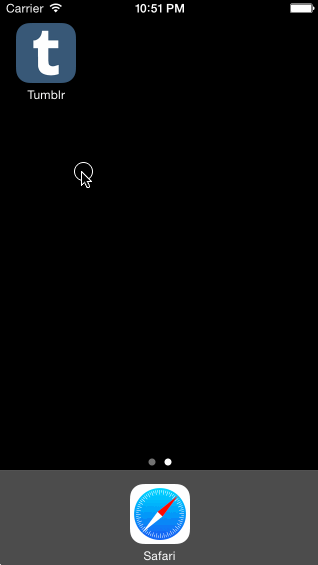

# Week5-Tumblr
This week, we leverage animations and gestures to create custom navigation.

<b> Overview - </b>
In this project, I've completed all the requirement along with a few options.
  
<b> Tasks Completed - </b>
- Implemented custom tab bar navigation
- Leveraged custom transitions and dynamically add views based on selected tab

<b> Time spent - </b>
I spent about 10 - 12 hours for this project.

<b> Demo </b>

